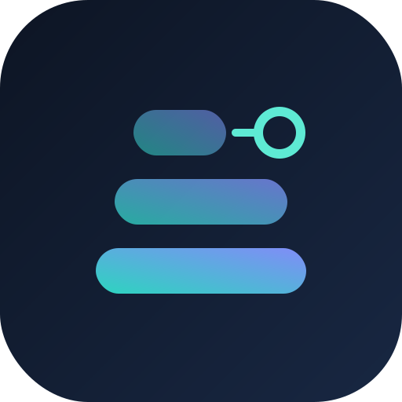
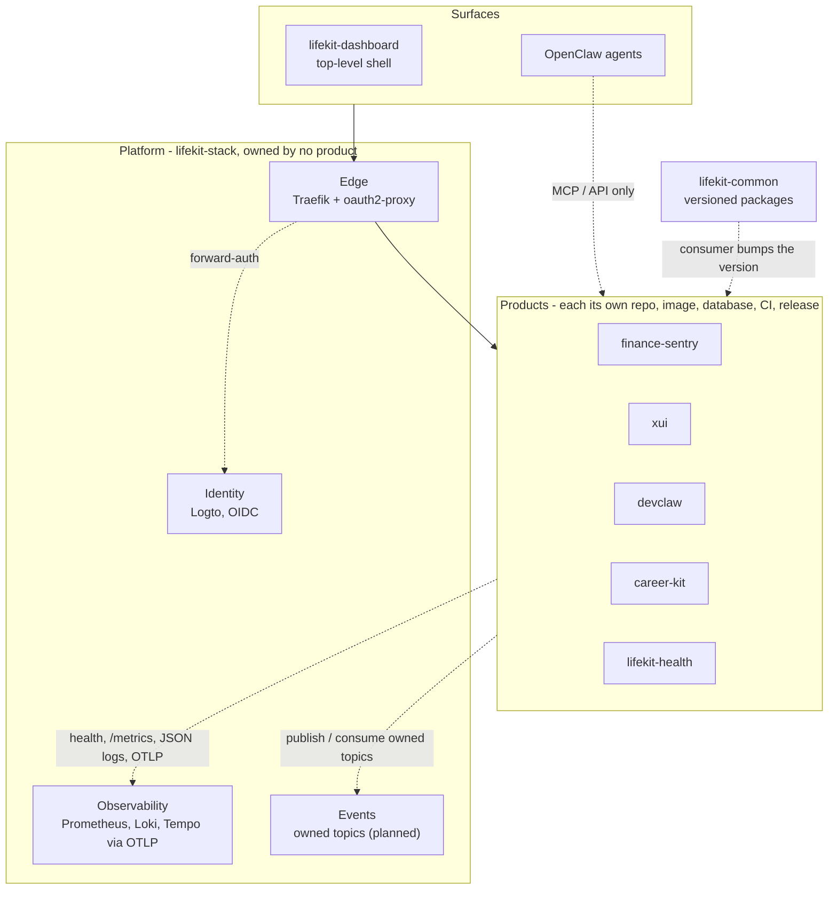

  

<h1 align="center">lifekit</h1>

<b>A self-hosted personal-AI stack - and the tools that run it.</b>

---

lifekit is built as a **federation, not a monolith**: one system, many repositories,
each cloneable, buildable, and shippable on its own. The hierarchy lives in *declaration
and wiring*, never in nested code - so any part can be replaced without disturbing the rest.

## The shape

Products are separate projects that run alone. The platform is owned by no product, and
the shared library is consumed as versioned packages. Arrows are contracts, not imports.

`lifekit-stack` is the composition root: it brings up the platform with zero products.
Every product must run alone with only a stub identity provider. That is what keeps it a
federation instead of a tangle - and why any part can be moved, replaced, or scaled on
its own.

### Shared only by contract

Products share nothing by code or runtime. The only things they have in common are:

- **Identity** - OIDC from one identity provider; each app keeps its own authorization.
- **The platform contract** - health and readiness, `/metrics`, JSON logs with a trace id,
  OTLP traces, running behind the edge, and owning its own topics.
- **Events on owned topics** - the only cross-product data path. Never another product's
  database or tables.
- **Versioned `lifekit-common` packages** - the consumer chooses when to bump; a cross-repo
  change is one PR per consuming repo.
- **Agents reach products through MCP or API only.**

## Open repositories

| Repo | What it is |
|---|---|
| [**lifekit-stack**](https://github.com/lifekit-hq/lifekit-stack) | Composition root - infrastructure-as-code that deploys the whole stack to a fresh VPS |
| [**lifekit-common**](https://github.com/lifekit-hq/lifekit-common) | Shared library, consumed as versioned packages; the reference implementation of the repo standard |
| [**lifekit**](https://github.com/lifekit-hq/lifekit) | The file-based personal-AI framework (the engine) |
| [**devclaw**](https://github.com/lifekit-hq/devclaw) | Durable-goal software-development loop: plan → sandboxed execution → verify gate → iterate |
| [**finance-sentry**](https://github.com/lifekit-hq/finance-sentry) | Personal finance platform: bank, crypto, and brokerage sync with budgets and alerts |
| [**lifekit-health**](https://github.com/lifekit-hq/lifekit-health) | Health module: workout tracking + daily-state capture behind one MCP server |
| [**life-state**](https://github.com/lifekit-hq/life-state) | Daily mood/energy/soreness/sleep capture primitive |

*(Instance-specific configuration and operator surfaces are kept private.)*

## The three rules that keep it a federation

1. **A change belongs to exactly one repository.** If a change must touch two at once, an edge
   got too thick - push the coupling back out to a declaration.
2. **Edges are declared and thin.** A component knows another only through a declared interface
   (an MCP tool, a URL, an env value) - never a code import.
3. **Surfaces federate, they don't merge.** One thin top shell links down the tree; the
   individual consoles stay independently shippable.

## Contributing

Issues and PRs are welcome on any public repository - see the
[contributing guide](https://github.com/lifekit-hq/.github/blob/main/CONTRIBUTING.md).
Security reports go through
[private advisories](https://github.com/lifekit-hq/.github/blob/main/SECURITY.md), never public issues.
